# ■ DocRate

> 실제 진료 경험 기반으로 의사를 평가하고 정보를 공유하는 플랫폼

---

## 📖 프로젝트 소개

DocRate는 사용자들이 **의사에 대한 리뷰를 작성하고 공유할 수 있는 서비스**입니다.  
신뢰할 수 있는 의료 정보를 제공하여 더 나은 의료 선택을 돕는 것을 목표로 합니다.

### 🎯 핵심 가치
- 실제 이용자 기반 리뷰 시스템
- 병원 및 의사 정보 투명성 확보
- 사용자 중심 의료 정보 제공

---

## 🛠️ 기술 스택

### ▷ Backend
- Java 17
- Spring Boot
- Spring Security (JWT 인증)
- JPA (Hibernate)

### ▷ Database
- MySQL 8
- Redis (Refresh Token 관리)

### ▷ Frontend
- Thymeleaf

### ▷ DevOps
- Docker / Docker Compose

---

## 🧱 아키텍처
```
Client (Browser)
      ↓
Spring Boot (Backend)
      ↓
┌───────────────┐
│   MySQL (DB)  │
│     Redis     │
└───────────────┘
```

---

## ⚙️ 주요 기능

### 👤 사용자
- 회원가입 / 로그인 (JWT 기반 인증)
- 마이페이지
- 리뷰 작성 및 조회

### 🏥 병원 / 의사
- 병원/의사 목록 조회
- 상세 정보 조회
- 의사/병원 추가 요청

### 📝 리뷰 시스템
- 별점 및 세부 평가 (친절도, 설명력 등)
- 평균 점수 계산

### 🛠 관리자 기능
- 병원/의사 요청 승인/거절
- 요청 관리

---

## 📂 프로젝트 구조

```
team6-DocRate
├── docker-compose.yml
├── .env
├── docrate
│   ├── Dockerfile
│   ├── src
│   │   ├── main
│   │   │   ├── java/com/team/docrate
│   │   │   │   ├── domain
│   │   │   │   ├── global
│   │   │   │   └── infra
│   │   │   └── resources
│   │   │       └── application-docker.properties
│   └── data
│       ├── db-init
│       └── db-load
```


## 🚀 실행 방법 (Docker)
### 1. 레포지토리 클론
```
git clone https://github.com/CLD-05/team6-DocRate.git
cd team6-DocRate
```

### 2. 환경변수 파일 생성 
: `.env.example` 파일을 복사하여 `.env` 파일 생성 후 값 수정
```
cp .env.example .env
vim .env
```

### 3. 컨테이너 실행
```
docker compose up -d --build
```

### 4. 실행 확인
```
docker compose ps
```

### 5. 접속
: 브라우저에서 `http://localhost:8080` 접속

---

## 🔐 인증 방식

DocRate는 **JWT 기반 인증 방식**을 사용합니다.

### ✔ 인증 구조

- Access Token + Refresh Token 구조  
- Access Token은 요청 인증에 사용  
- Refresh Token은 Redis에 저장하여 관리  

### ✔ 토큰 재발급

- Access Token 만료 시 Refresh Token을 이용해 재발급  

### ✔ 로그아웃 처리

- 로그아웃 시 Redis에서 Refresh Token 삭제  

### ✔ 인증 처리 방식

- Spring Security + JWT 필터 기반 인증/인가 처리  

---

## 📊 데이터 초기화

프로젝트 실행 시 다음과 같이 데이터가 초기화됩니다.

### ✔ 1. 테이블 생성

- `docrate/data/db-init/app.sql` 실행  
- MySQL 컨테이너 시작 시 자동 적용  

### ✔ 2. 초기 데이터 적재

- `departments.csv` → 진료과 데이터  
- `건강_병원.csv` → 병원 데이터  
- `db-load` 컨테이너에서 자동 실행  

### ✔ 3. 이후 데이터 관리

- users, reviews, doctor_requests, hospital_requests는  
  → 실제 서비스 사용을 통해 생성  

---

## 📎 향후 개선 사항
- AWS 배포 (EC2 + RDS + ElasticCache)

---

## 📸 화면

### 🏠 메인 페이지
- 병원 및 의사 검색를 시작할 수 있는 진입 화면
- 병원명 또는 의사명 기반 검색 기능 제공

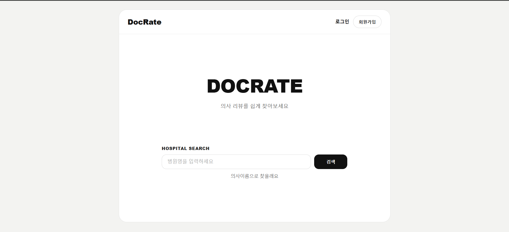

---

### 🏥 병원 목록 페이지 (전체 조회)
- 전체 병원 데이터를 리스트 형태로 제공
- 병원 정보(이름, 주소, 전화, 진료분야) 확인 가능

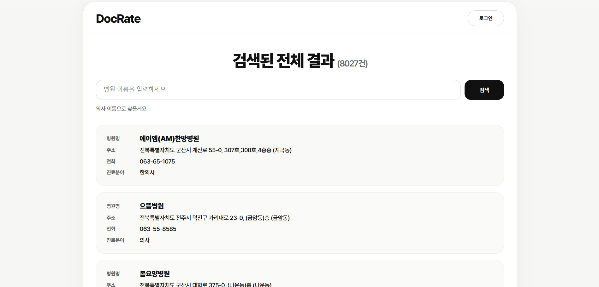

---

### 🔍 병원 검색 결과 페이지
- 병원명 기반 검색 결과 제공
- 검색된 병원 상세 정보 확인 가능
- 원하는 병원이 없을 경우 추가 요청 기능 제공

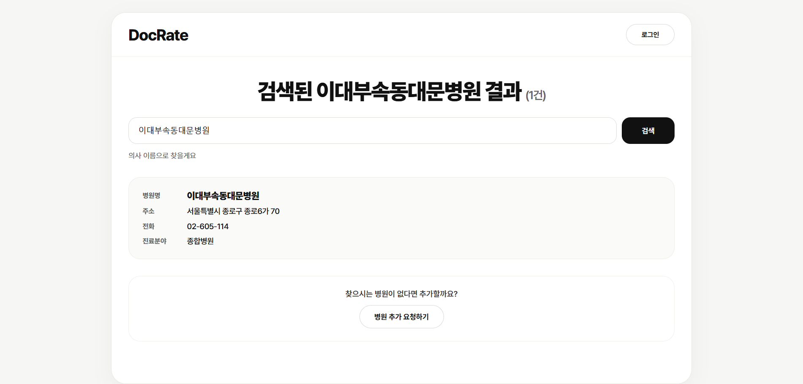

---

### 🏥 병원 상세 페이지
- 병원의 기본 정보(주소, 전화번호, 진료분야 등) 제공
- 소속 의사 목록 조회 가능
- 의사 상세 페이지로 이동 가능
- 병원에 의사가 없을 경우 추가 요청 기능 제공

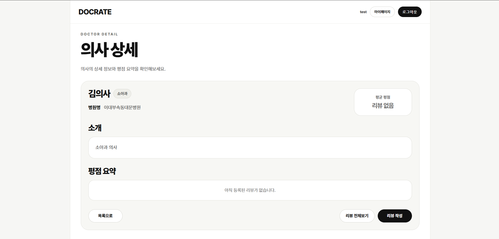

---

### 🏥 병원 등록 요청 폼
- 찾는 병원이 없을 경우 신규 병원 등록을 요청할 수 있는 화면
- 병원명, 주소, 전화번호 등 필요한 정보를 입력하여 요청 가능

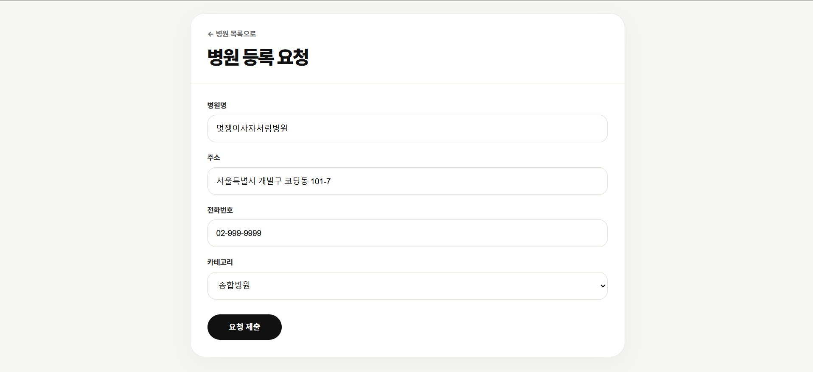

---

### 👨‍⚕️ 의사 목록 페이지 (전체 조회)
- 전체 의사 데이터를 리스트 형태로 제공
- 의사 정보(이름, 소속 병원, 진료과 등) 확인 가능

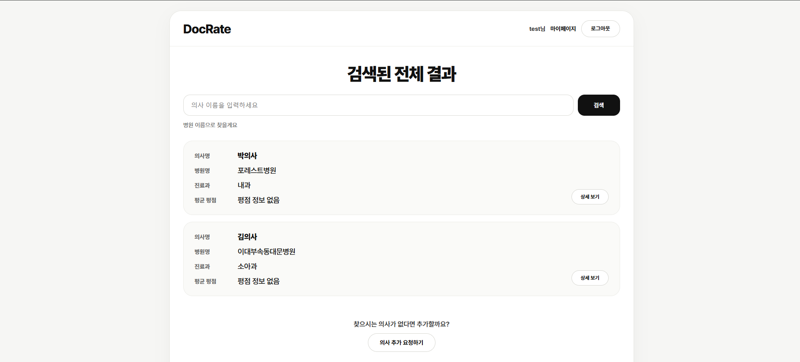

---

### 🔍 의사 검색 결과 페이지
- 의사 이름 기반 검색 결과 제공
- 검색된 의사 상세 정보 확인 가능
- 원하는 의사가 없을 경우 추가 요청 기능 제공

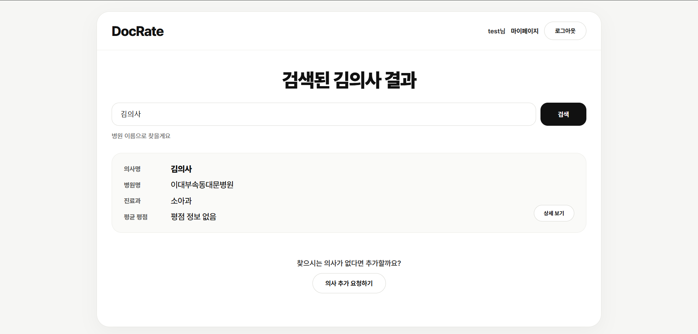

---

### 👨‍⚕️ 의사 상세 페이지
- 의사의 기본 정보 및 소속 병원 정보 제공
- 의사 소개 및 진료과 확인 가능
- 리뷰 요약 및 평균 평점 확인
- 리뷰 작성 및 전체 리뷰 조회 기능 제공


---

### 👨‍⚕️ 의사 등록 요청 폼
- 찾는 의사가 없을 경우 신규 의사 등록을 요청할 수 있는 화면
- 의사명, 소속 병원, 진료과 등 필요한 정보를 입력하여 요청 가능

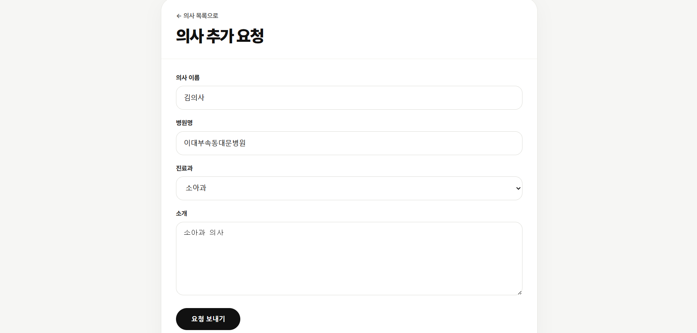

---

### 📝 리뷰 작성 페이지
- 별점 및 세부 평가를 작성할 수 있는 화면

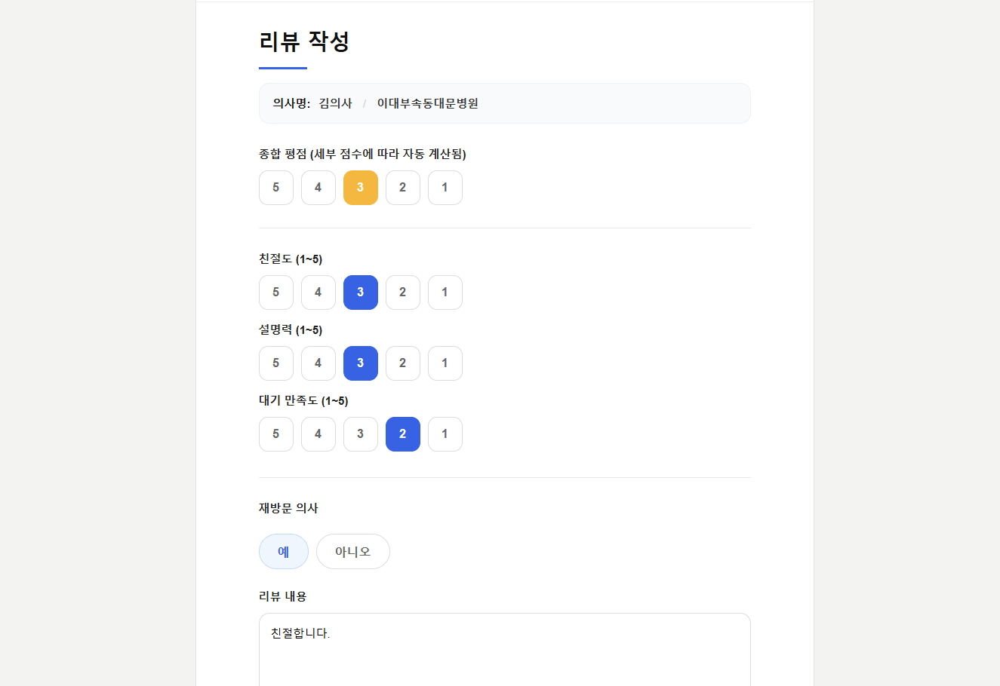

---

### 📝 의사 리뷰 목록 페이지
- 해당 의사에 대한 전체 리뷰를 확인할 수 있는 화면
- 사용자들의 실제 진료 경험 기반 리뷰 제공
- 평점 및 세부 평가(친절도, 설명력 등) 확인 가능

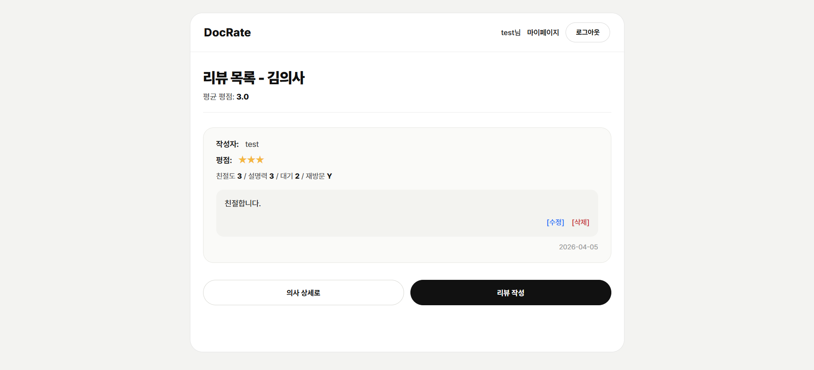

---

### 👤 마이페이지
- 사용자 정보, 내가 작성한 리뷰 및 요청 내역을 확인할 수 있는 화면

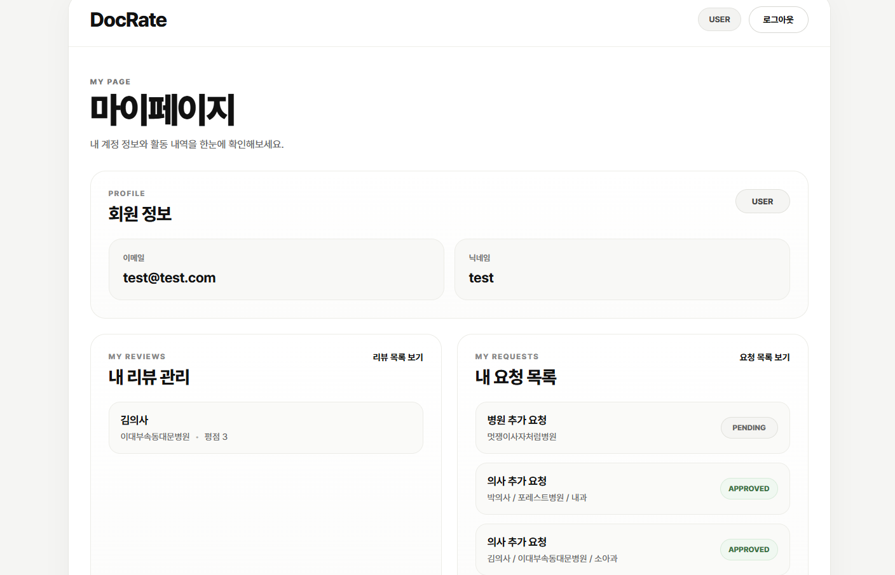

---

### 🛠 관리자 페이지
- 병원/의사 요청을 승인 또는 거절할 수 있는 관리 화면

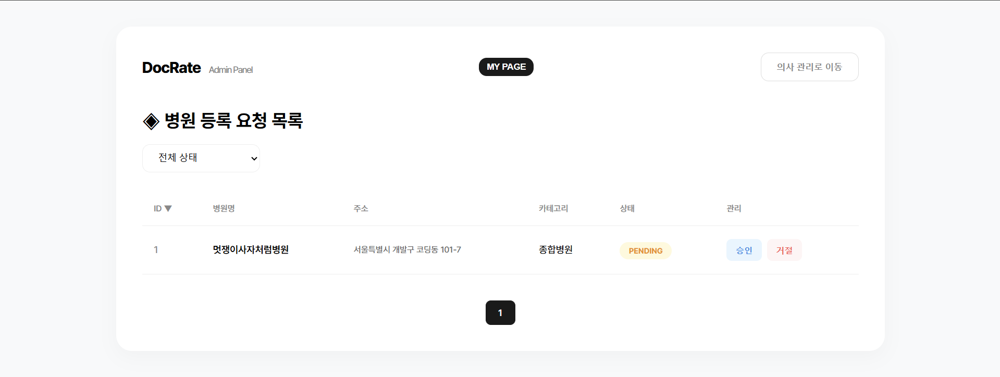
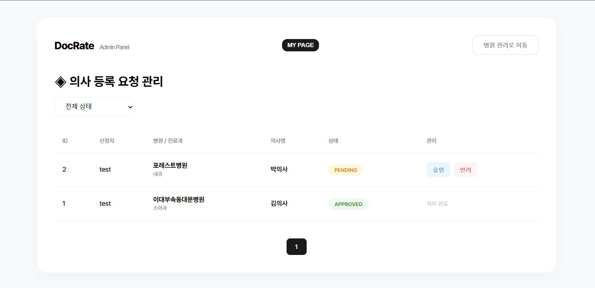


